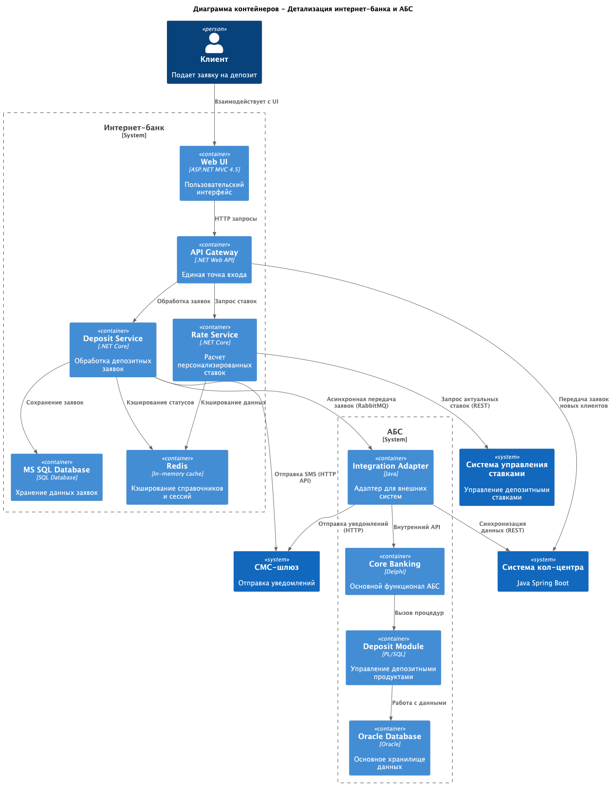
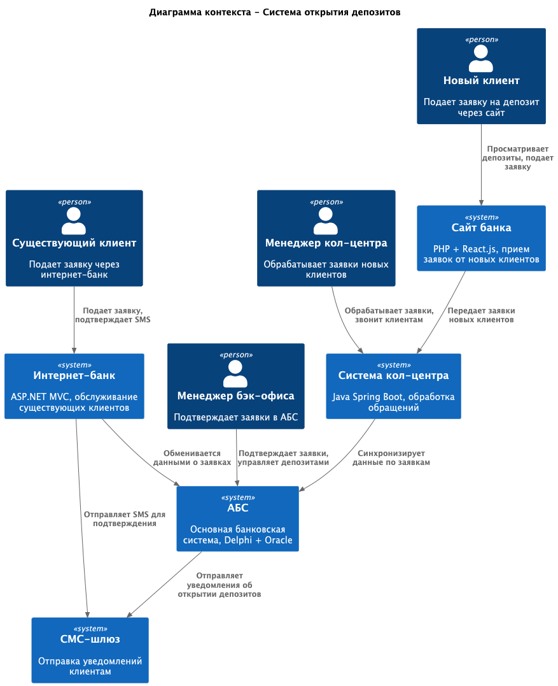

# ADR: Архитектура MVP системы открытия депозитов

## Название задачи:
Архитектура MVP системы цифровизации открытия депозитов

## Функциональные требования

| № | Действующие лица или системы | Use Case | Описание |
|---|-----------------------------|----------|-----------|
| 1 | Клиент (новый) + Сайт | Подача заявки на депозит через сайт | 1. Клиент просматривает доступные депозиты 2. Заполняет форму (ФИО, телефон) 3. Система шифрует и сохраняет данные 4. Заявка передается в кол-центр |
| 2 | Клиент (существующий) + Интернет-банк | Подача заявки через интернет-банк | 1. Клиент авторизуется 2. Видит персонализированные ставки 3. Выбирает счет и сумму 4. Подтверждает SMS-кодом 5. Заявка создается в системе |
| 3 | Менеджер кол-центра + Система кол-центра | Обработка заявки с сайта | 1. Получает уведомление о новой заявке 2. Изучает данные клиента 3. Звонит для уточнения деталей 4. Может предложить особые условия |
| 4 | Менеджер бэк-офиса + АБС | Обработка заявки в АБС | 1. Проверяет поступившие заявки 2. Подтверждает условия депозита 3. Вводит данные в АБС 4. Инициирует отправку уведомлений |
| 5 | Система + СМС-шлюз | Отправка уведомлений клиенту | 1. Генерация SMS-кода для подтверждения 2. Уведомление о подтверждении ставки 3. Уведомление об открытии депозита |
| 6 | Администратор + Система управления ставками | Управление ставками депозитов | 1. Ввод и обновление ставок 2. Настройка персонализированных условий 3. Расчет ставок на основе рисков |

## Нефункциональные требования

| № | Требование |
|---|------------|
| 1 | Шифрование передаваемых данных (TLS 1.2+) |
| 2 | Время отклика UI < 100 мс |
| 3 | Доступность 99.9% |
| 4 | Поддержка 1000+ concurrent users |
| 5 | Резервирование в двух ЦОД |
| 6 | Совместимость с существующим стеком технологий |
| 7 | Горизонтальное масштабирование |
| 8 | Подробная документация и логирование |
| 9 | Избежание прямой нагрузки на АБС |
| 10 | Использование внутренней экспертизы разработки |

## Решение

### Архитектурный подход

Для MVP системы открытия депозитов выбрана **гибридная микросервисная архитектура** с использованием асинхронной коммуникации через брокер сообщений. Это позволяет:

1. **Изолировать АБС** от прямой нагрузки через буферизацию запросов
2. **Обеспечить горизонтальное масштабирование** компонентов интернет-банка
3. **Сохранить совместимость** с существующей инфраструктурой
4. **Подготовить почву** для будущего полного перехода на микросервисы

### Ключевые компоненты системы

#### 1. Веб-интерфейсы (Frontend)
- **Сайт (PHP + React.js)**: Для новых клиентов с формой заявки
- **Интернет-банк (ASP.NET MVC)**: Для существующих клиентов с расширенным функционалом

#### 2. Серверные компоненты (Backend)
- **API Gateway (.NET Web API)**: Единая точка входа для всех запросов
- **Deposit Service (.NET Core)**: Микросервис обработки депозитных заявок
- **Rate Calculation Service**: Сервис расчета персонализированных ставок
- **Notification Service**: Сервис управления уведомлениями

#### 3. Инфраструктурные компоненты
- **RabbitMQ**: Брокер сообщений для асинхронной коммуникации
- **Redis**: Кэширование справочных данных и сессий
- **MS SQL Server**: Хранение данных интернет-банка и заявок
- **Oracle Database**: Основная база данных АБС (только чтение)

#### 4. Интеграционные компоненты
- **АБС Adapter**: Адаптер для безопасной коммуникации с АБС
- **SMS Gateway Connector**: Интеграция с СМС-шлюзом
- **Call Center Integration**: Интеграция с системой кол-центра

### Схемы интеграции

